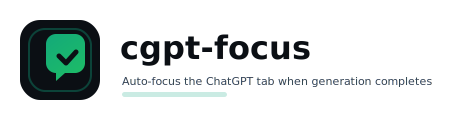

# cgpt-focus

<p align="center">
  
</p>

**cgpt-focus** is a tiny Chrome extension that:

- **Auto-focuses** the most recently submitted ChatGPT tab **only after generation finishes** (Stop button disappears).
- **Scrolls** to the bottom of the latest assistant response—right to the **Copy/Edit action row**.

Built to avoid the annoying “switches too early” behavior and to survive ChatGPT’s React UI re-renders.

---

## ✨ Features

- ✅ Focus the **latest submitted** ChatGPT tab when output completes
- ✅ Never switches early (waits for **Stop streaming** button to disappear)
- ✅ Works across multiple ChatGPT tabs
- ✅ Scrolls to the final assistant action controls (Copy/Edit)
- ✅ React-safe: document-level capture listeners survive DOM swaps

---

## 📦 Install (Unpacked)

1. Download the zip and extract it.
2. Open Chrome → `chrome://extensions`
3. Enable **Developer mode**
4. Click **Load unpacked**
5. Select the extracted folder: `cgpt-focus/`
6. Open ChatGPT and refresh the tab(s).

---

## 🧠 How it Works

- On submit (Enter / Send click), we generate a per-run token and mark that tab as the “latest submission”.
- While ChatGPT streams, the **Stop** button exists.
- When the Stop button disappears, we:
  1. Scroll to the last assistant action row (Copy button)
  2. Tell the background script to focus that tab (only once per run)

---

## 📂 Project Structure

```text
cgpt-focus/
├── manifest.json
├── background.js
├── content.js
├── README.md
└── assets/
    ├── cgpt-focus-logo.svg
    └── icons/
        ├── cgpt-focus-icon-16.png
        ├── cgpt-focus-icon-32.png
        ├── cgpt-focus-icon-48.png
        └── cgpt-focus-icon-128.png
```

---

## 🔧 Customization

- Polling interval:
  - `POLL_MS` in `content.js` (default: 250ms)
- Scroll offset:
  - `scrollMarginTop` (default: 80px)

---

## 📝 License

MIT — do whatever you want.
